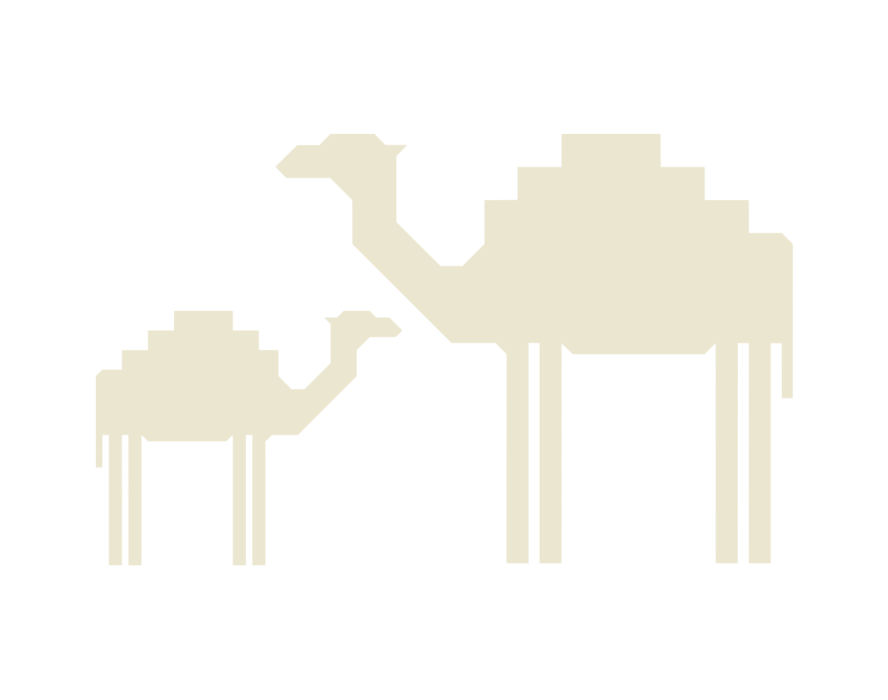
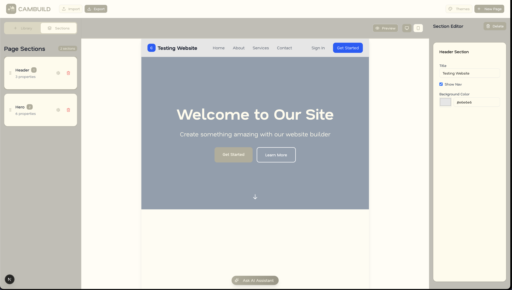

# CAMBUILD - Visual Website Builder

A modern, mini website builder built with Next.js, React, and TypeScript. Create beautiful websites with an intuitive visual interface, real-time preview, and AI-powered assistance.



## Demo



*The CAMBUILD interface showing the visual website builder with section library, live preview, and property editor.*

## Features

- **Visual Drag & Drop Builder** - Intuitive interface for building websites without code
- **Responsive Design** - All sections are mobile-friendly and responsive
- **Section Library** - Pre-built sections including Header, Hero, Features, About, Contact, and Footer
- **Real-time Preview** - See changes instantly as you build
- **AI Chat Assistant** - Get help and suggestions while building
- **Import/Export** - Save and share your website configurations
- **Customizable Themes** - Easy styling and customization options
- **Mobile-Friendly Interface** - Build on any device with responsive controls

## Tech Stack

- **Framework**: [Next.js 15](https://nextjs.org/) with App Router
- **Language**: [TypeScript](https://www.typescriptlang.org/)
- **Styling**: [Tailwind CSS 4](https://tailwindcss.com/)
- **UI Components**: [Radix UI](https://www.radix-ui.com/)
- **State Management**: [Zustand](https://zustand-demo.pmnd.rs/)
- **Drag & Drop**: [@dnd-kit](https://dndkit.com/)
- **Icons**: [Lucide React](https://lucide.dev/)
- **Fonts**: Custom Humane font family

## Project Structure

```
src/
├── app/                    # Next.js app directory
│   ├── layout.tsx         # Root layout
│   ├── page.tsx           # Home page
│   └── globals.css        # Global styles
├── components/
│   ├── builder/           # Builder interface components
│   │   ├── BuilderLayout.tsx
│   │   ├── SectionLibrary.tsx
│   │   ├── SectionEditor.tsx
│   │   ├── PreviewArea.tsx
│   │   └── AIChatInput.tsx
│   ├── sections/          # Section components
│   │   ├── Header.tsx
│   │   ├── Hero.tsx
│   │   ├── Features.tsx
│   │   ├── About.tsx
│   │   ├── Contact.tsx
│   │   └── Footer.tsx
│   └── ui/                # Reusable UI components
├── data/
│   └── section-templates.ts  # Section definitions
├── store/
│   └── builder-store.ts   # Zustand state management
├── types/
│   └── builder.ts         # TypeScript type definitions
└── lib/
    ├── utils.ts           # Utility functions
    └── fonts.ts           # Font configuration
```

Built with ❤️ using modern web technologies
